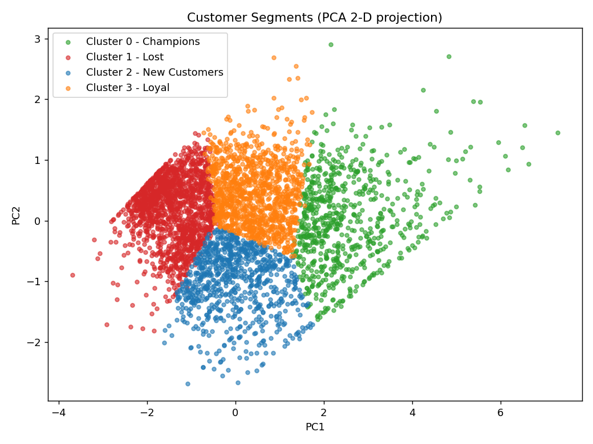
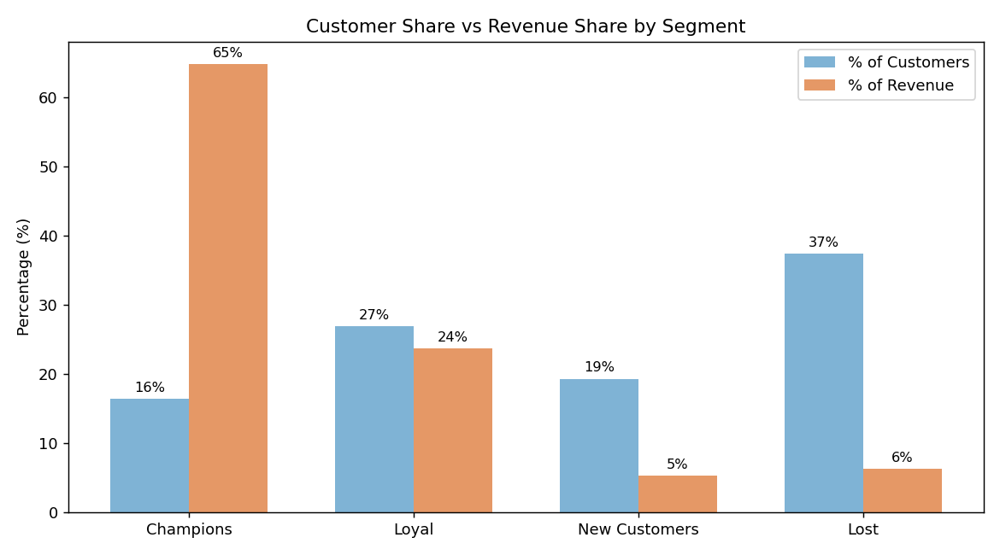

# E-Commerce Customer Segmentation System

**RFM Analysis & K-Means Clustering on real e-commerce transaction data**, with PCA visualization and actionable customer segments. *(Flask web app — in progress.)*

---

## Overview

Online retailers often hold hundreds of thousands of raw transactions but have no clear or proper view of *who* their customers actually are. This project turns ~392K cleaned transactions into **4 distinct, named customer segments** by using unsupervised machine learning, and that can translates them into a clear business actions.

**Headline insight:** just **16% of customers (the "Champions") generate ~65% of total revenue**, while the largest group ("Lost", 37% of customers) contributes only ~6%.

## Dataset

we used the UCI **Online Retail** dataset — transaction-level data from a UK-based online gift retailer, Dec 2010 – Dec 2011 (541,909 rows).
which Downloaded it from the UCI Machine Learning Repository or Kaggle (search *"UCI Online Retail dataset"*) and place `Online_Retail.xlsx` in `data/raw/`.

## Approach

1. **Data Cleaning** — removed the missing customer IDs, cancellations, invalid quantities/prices, and duplicates (541,909 → 392,692 rows).
2. **RFM Feature Engineering** — built three behavioral features per customer: **Recency**, **Frequency**, **Monetary**.
3. **Scaling** — log-transform to reduce heavy skew, then standardization which (required for distance-based K-Means).
4. **Choosing K** — Elbow method + Silhouette score → **K = 4**.
5. **K-Means Clustering** — assigned each of 4,338 customers to a segment.
6. **PCA Visualization** — projected 3 features into 2-D (retaining ~94% of variance) to visualize the segments.
7. **Interpretation** — named the segments and derived business recommendations.

## Results

| Segment | Customers | % of Base | Avg Recency | Avg Frequency | Avg Monetary | % of Revenue |
|---|---|---|---|---|---|---|
| **Champions** | 713 | 16% | 12 days | 14 orders | £8,088 | **65%** |
| **Loyal** | 1,166 | 27% | 72 days | 4 orders | £1,802 | 24% |
| **New Customers** | 837 | 19% | 18 days | 2 orders | £557 | 5% |
| **Lost** | 1,622 | 37% | 182 days | 1 order | £341 | 6% |

**Segments in PCA space:**



**Customer share vs revenue share:**



### Business recommendations
- **Champions** -> protect with VIP perks, loyalty rewards, early access.
- **Loyal** -> upsell and nurture toward Champion status.
- **New Customers** -> strong onboarding and second-purchase incentives.
- **Lost** -> low-cost win-back campaigns only.

## Project Structure

```
ecommerce-customer-segmentation/
├── data/
│   ├── raw/          # original dataset (not tracked — download separately)
│   └── processed/    # RFM tables and clustered output
├── notebooks/        # analysis notebook(s)
├── outputs/figures/  # saved charts
├── src/              # reusable code (for the upcoming Flask app)
├── requirements.txt
└── README.md
```

## How to Run

```bash
pip install -r requirements.txt
# place Online_Retail.xlsx in data/raw/, then open the notebook:
jupyter notebook notebooks/
```

## Tech Stack

Python · pandas · NumPy · scikit-learn (KMeans, PCA, StandardScaler, silhouette) · matplotlib · Jupyter

## Roadmap

- [x] Full ML segmentation pipeline (cleaning -> RFM -> K-Means -> PCA -> insights)
- [ ] **Flask web app** — input a customer's RFM values and get their predicted segment
- [ ] Deploy live demo

## Author

*[DEVI PRASANTH KARUMANCHI]* — Machine Learning / AI
[linkedin.com/in/deviprasanthkarumanchi](#)
