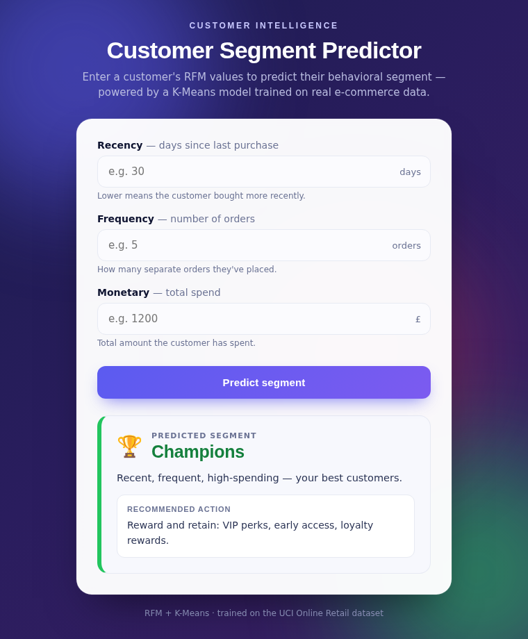

# E-Commerce Customer Segmentation System

**RFM Analysis & K-Means Clustering on real e-commerce data**, with PCA visualization, actionable customer segments, and a **live Flask web app** that predicts a customer's segment from their RFM values.

🔗 **Live demo:** https://your-app-name.onrender.com  *(replace with your Render URL)*

---

## Overview

Online retailers often hold hundreds of thousands of raw transactions but have no clear or proper view of *who* their customers actually are. This project turns ~392K cleaned transactions into **4 distinct, named customer segments** by using the unsupervised machine learning, that translates them into clear business actions, and serves predictions through a deployed web app.

**Headline insight:** just **16% of customers (the "Champions") generate ~65% of total revenue**, while the largest group ("Lost", 37% of customers) contributes only ~6%.

## Web App

A Flask app where you enter there customer's Recency, Frequency, and Monetary values and instantly get their predicted segment and also there recommended marketing action.



## Dataset

UCI **Online Retail** dataset — transaction-level data from a UK-based online gift retailer, Dec 2010 – Dec 2011 (541,909 rows).
Download from the UCI Machine Learning Repository or Kaggle (search *"UCI Online Retail dataset"*) and place `Online_Retail.xlsx` in `data/raw/`.

## Approach

1. **Data Cleaning** — removed the missing IDs, cancellations, invalid quantities/prices, duplicates (541,909 → 392,692 rows).
2. **RFM Feature Engineering** — Recency, Frequency, Monetary per customer.
3. **Scaling** — log-transform to reduce skew, then standardization (required for distance-based K-Means).
4. **Choosing K** — Elbow method + Silhouette score → **K = 4**.
5. **K-Means Clustering** — assigned each of 4,338 customers to a segment.
6. **PCA Visualization** — projected 3 features into 2-D (~94% of variance retained).
7. **Interpretation** — named segments and derived business recommendations.
8. **Deployment** — saved the trained model and served it via a Flask web app on Render.

## Results

| Segment | Customers | % of Base | Avg Recency | Avg Frequency | Avg Monetary | % of Revenue |
|---|---|---|---|---|---|---|
| **Champions** | 713 | 16% | 12 days | 14 orders | £8,088 | **65%** |
| **Loyal** | 1,166 | 27% | 72 days | 4 orders | £1,802 | 24% |
| **New Customers** | 837 | 19% | 18 days | 2 orders | £557 | 5% |
| **Lost** | 1,622 | 37% | 182 days | 1 order | £341 | 6% |

**Segments in PCA space:**


**Customer share vs revenue share:**


### Business recommendations
- **Champions** -> protect with VIP perks, loyalty rewards, early access.
- **Loyal** -> upsell and nurture toward Champion status.
- **New Customers** -> strong onboarding and second-purchase incentives.
- **Lost** -> low-cost win-back campaigns only.

## Project Structure

```
ecommerce-customer-segmentation/
├── data/
│   ├── raw/          # original dataset (not tracked — download separately)
│   └── processed/    # RFM tables and clustered output
├── models/           # saved scaler, K-Means model, segment map (.pkl)
├── notebooks/        # analysis notebook
├── outputs/figures/  # saved charts
├── src/
│   ├── app.py        # Flask web app
│   └── templates/
│       └── index.html
├── requirements.txt
└── README.md
```

## How to Run

**The analysis notebook:**
```bash
pip install -r requirements.txt
# place Online_Retail.xlsx in data/raw/, then:
jupyter notebook notebooks/
```

**The web app (locally):**
```bash
pip install -r requirements.txt
cd src
python app.py
# open http://127.0.0.1:5000
```

## Tech Stack

Python · pandas · NumPy · scikit-learn (KMeans, PCA, StandardScaler, silhouette) · matplotlib · Flask · Gunicorn · Jupyter

## Roadmap

- [x] Full ML segmentation pipeline (cleaning -> RFM -> K-Means -> PCA -> insights)
- [x] Flask web app — predict a customer's segment from RFM values
- [x] Live deployment on Render

## Author

*[DEVI PRASANTH KARUMANCHI]* — Machine Learning / AI
